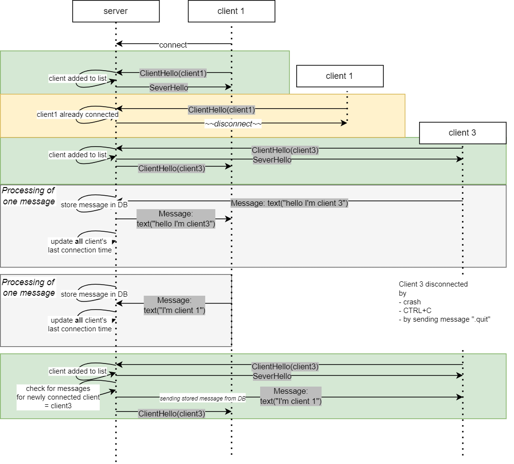

# O co jde

Chatovací aplikace. Jeden server a více klientů. Klienti si přes server posílají zprávy, obrázky a soubory.

# Jak spustit

Nejdříve spustit server. Poté, co nastartuje, je možné pouštět klienty.

**Server:**
```
cd hw11\server
set RUST_LOG=info
cargo run -- -s 127.0.0.1 -p 8080
```

**Client:**
```
cd hw11\client
set RUST_LOG=info
cargo run -- -s 127.0.0.1 -p 8080 -u "hugo"
```

Note:
> Pro různé simulace chybových stavů je možné spustit u obou (server/client) `run8080_with_chaos_monkey.bat`. V tomto módu náhodně padá (de)serializace zpráv. 
> Toto jsem používal v dřívějších úlohách (hw13 tuším) na simulaci chyb. V tuto chvíli už nechané jen pro případ.

Jak vypadá standardní interakce:


# Commandy (strana klienta)
- `.file <path>`: 
    - klient pošle soubor na server
    - server rozešle ostatním klientům, ti si ho uloží do adresáře `files`
- `.image <path>`: 
    - pošle obrázek (předpokládá se, že jde o .png). 
    - server rozešle ostatním klientům, ti si ho uloží do adresáře `images` s příponou `.png`
- `.quit`:
    - ukončí klienta
- jakýkoliv jiný text:
    - pošle se jako textová zpráva na ostatní klienty
    


# Design

## Security

Bezpečnost jsem nepovažoval za potřebnou. Je to tak jednoduchá aplikace, že prosté specifikování username na command lině je dostatečné. 

Krom toho kryptování zpráv, uchovávání hesel atd. je něco, na co se mi už nedostává času, takže byla volba, kam čas investovat lépe. 

## Async
Vše je async za použití tokio.

Vzhledem k tomu, že testy není možné mít asynchronní, použil jsem `tokio_test`, i když mám tuchu, že v prezentaci byla jiná varianta.
Note: *matně si pamatuju, že jsme se async testů dotkli, ale i tady jsem záměrně použil jednodušší řešení*.

Odpadly tak starosti, jak číst ze stramu s timeoutem.

## Tasks

Záměrně jsem se vyhnul použití mutexů a navázaných technik a zkusil jsem výhradně použít *channels*. Jde především o kód na serveru.

### Server - N* task pro příchozí zprávy

Pro každého klienta (TCP spojení) vytvořím task, kde čekám na zprávu od klienta. Po dekódování je zpráva poslána kanálem dále ke zpracování.

Viz funkce:
```rust
.\hw15\server\src\main.rs

async fn spawn_new_task_handling_one_client(
        user_name: String, 
        mut stream: OwnedReadHalf, 
        tx_msg: Sender<IncommingClientMessage>)
```

### Server - 1 task registrující připojené klienty a rozesílající zprávy broadcastem

V každém předchozím tasku (funkce `spawn_new_task_handling_one_client`) se používá `tx_msg: Sender<IncommingClientMessage>`, kam se zapisuje zpráva došlá od nějakého klienta.

Na druhém konci pak poslouchá 1 task společný pro všechny clienty. 

Viz funkce:
```rust
.\hw15\server\src\main.rs

fn spawn_task_holding_connected_clients(
    mut rx_sock: Receiver<ConnectedClient>,
    mut rx_msg: Receiver<IncommingClientMessage>,
    tx_client_disconnect: Sender<String>)
```

Je to aktor, který
- drží si povědomí o připojených klientech na jednom místě - kvůli broadcastu
- naslouchá od ostatních tasků na příchozí zprávy 
- v případě, že se klient odpojí, pošle informaci kanálem (viz `tx_client_disconnect`) do hlavního vlákna
    - to je potřeba pro správnou funkci handshake

Diagram tasků:


#### Slabé místo - duplicita dat

Jména registrovaných klientů jsou na dvou místech.

1. v hlavním vlákně, které naslouchá na příchozí spojení. Tady je potřeba znát všechn jména proto, aby nebylo možné nechat připojit klienta se stejným jménem dvakrát.

2. v broadcast tasku. Zde je potřeba pro správnou funkci broadcastu, ukládání dat do db (např. kdy naposledy byl uživatel přihlášen) atd.

Bylo by ideální mít možnost obousměrné mezitaskové komunikace, ale tu jsem zatím nenašel. Abych obě hromady dat synchronizoval, použil jsem alespoň jednosměrný kanál z broadcast tasku, který notifikuje hlavní vlákno o tom, že se klient odpojil. 

Na základě tohoto oznámení pak hlavní vlákno může klienta vymazat ze seznamu a dovolí mu připojit se později.

#### Slabé místo - nepřehlednost kanálů

Na první pohled není úplně jasné, odkud kam který kanál směřuje. Na druhou stranu vzhledem k tomu, že je jasný směr (`tx` vs. `rx`), je tok dat jasný a dá se lépe usuzovat, jak se s daty pracuje, než za použití mutexů. Alespoň subjektivně to tak vnímám.