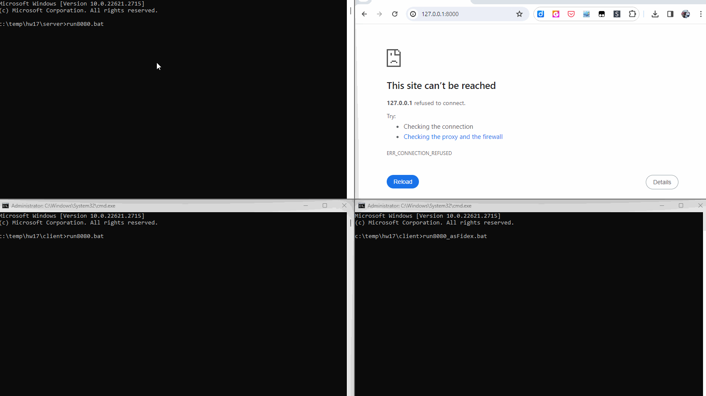
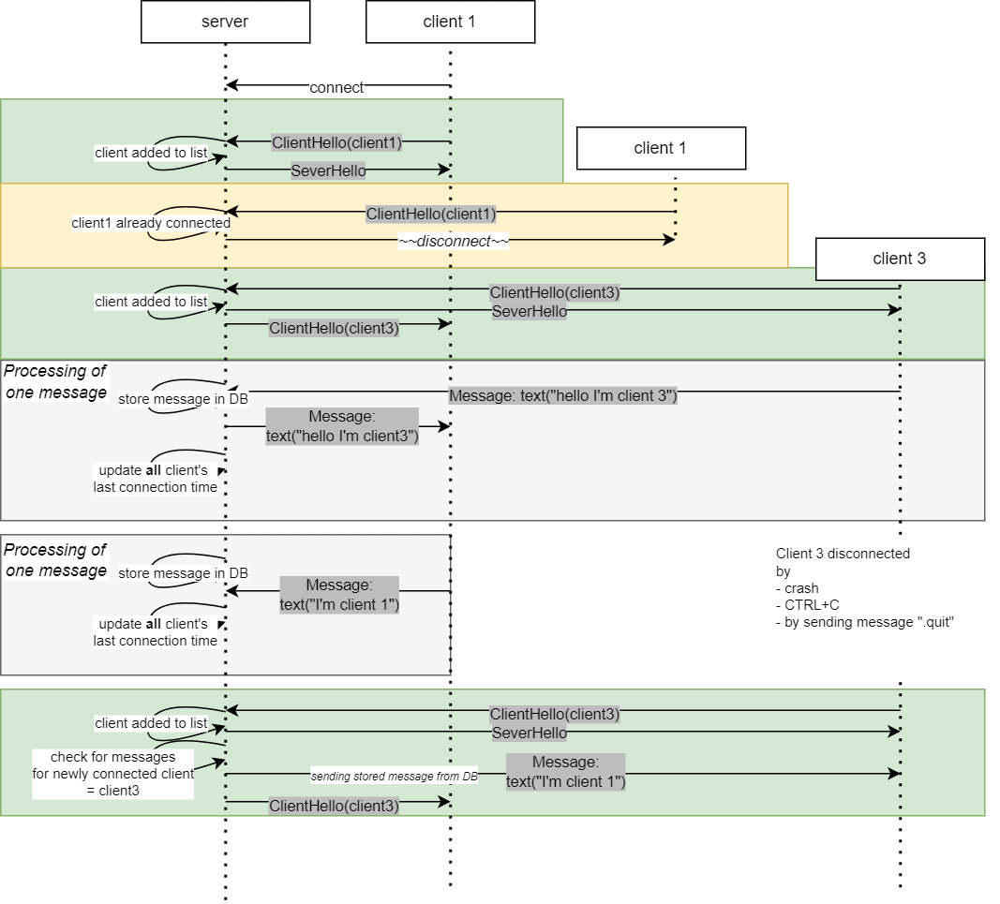
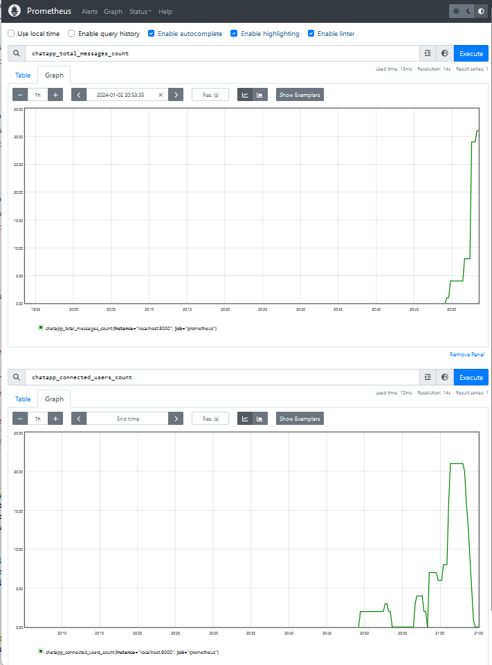

# O co jde


**Předchozí verze**: předchozí verze je dostupná v předchozím [projektu](https://github.com/stej/rstnpc/tree/main/hw15).

Chatovací aplikace. Jeden server a více klientů. Klienti si přes server posílají zprávy, obrázky a soubory.

# Jak spustit

Nejdříve spustit server. Poté, co nastartuje, je možné pouštět klienty.

**Server:**
```
cd hw11\server
set RUST_LOG=info
cargo run -- -s 127.0.0.1 -p 8080
```

**Client:**
```
cd hw11\client
set RUST_LOG=info
cargo run -- -s 127.0.0.1 -p 8080 -u "hugo"
```

Note:
> Pro různé simulace chybových stavů je možné spustit u obou (server/client) `run8080_with_chaos_monkey.bat`. V tomto módu náhodně padá (de)serializace zpráv. 
> Toto jsem používal v dřívějších úlohách (hw13 tuším) na simulaci chyb. V tuto chvíli už nechané jen pro případ.

Jak vypadá standardní interakce - cmdline rozhraní viz [animace](https://github.com/stej/rstnpc/tree/main/hw15/hw15.gif).

Nově dodaná funkcionalita - velmi jednoduchá správa přes web.


# Commandy (strana klienta)
- `.file <path>`: 
    - klient pošle soubor na server
    - server rozešle ostatním klientům, ti si ho uloží do adresáře `files`
- `.image <path>`: 
    - pošle obrázek (předpokládá se, že jde o .png). 
    - server rozešle ostatním klientům, ti si ho uloží do adresáře `images` s příponou `.png`
- `.quit`:
    - ukončí klienta
- jakýkoliv jiný text:
    - pošle se jako textová zpráva na ostatní klienty
    


# Design

## Security

Bezpečnost jsem nepovažoval za potřebnou. Je to tak jednoduchá aplikace, že prosté specifikování username na command lině je dostatečné. 

Krom toho kryptování zpráv, uchovávání hesel atd. je něco, na co se mi už nedostává času, takže byla volba, kam čas investovat lépe. 

## Async
Vše je async za použití tokio.

Vzhledem k tomu, že testy není možné mít asynchronní, použil jsem `tokio_test`, i když mám tuchu, že v prezentaci byla jiná varianta.
Note: *matně si pamatuju, že jsme se async testů dotkli, ale i tady jsem záměrně použil jednodušší řešení*.

Odpadly tak starosti, jak číst ze stramu s timeoutem.

## Tasks / Actors

V [předchozí verzi](https://github.com/stej/rstnpc/tree/main/hw15) byly použity pouze tasky. V této verzi už kvůli přehlednosti a také kvůli přístupu k databázi z více míst (aby nebylo nutné synchronizovat přístup ručně) jsem použil actory, viz [ractor](https://github.com/slawlor/ractor).

### Server - N* task pro příchozí zprávy

*(funkce zůstává stejná jako byla ve verzi hw15)*

Pro každého klienta (TCP spojení) vytvořím task, kde čekám na zprávu od klienta. Po dekódování je zpráva poslána kanálem dále ke zpracování.

Viz funkce:
```rust
.\hw15\server\src\main.rs

async fn spawn_new_task_handling_one_client(
        user_name: String, 
        mut stream: OwnedReadHalf, 
        tx_msg: Sender<IncommingClientMessage>)
```

### Server - 1 actor udržující info o připojených klientech a rozesílající zprávy broadcastem

Viz funkce:
```rust
.\hw15\server\src\actor_connected_clients.rs

// messages:
pub enum ConnectedClientsActorMessage
{
    IncommingChatMessage {
        user_name: String,
        message: Message,
    },
    NewClient {
        user_name: String,
        stream_writer: OwnedWriteHalf
    },
    CheckUserCanConnect(String, RpcReplyPort<bool>),    // todo: struct?
}
```

Je to aktor, který
- naslouchá od ostatních tasků na příchozí zprávy 
- drží zapisovací konec TCP streamu - kvůli broadcastu
- reaguje na dotazy, zda se klient může připojit (klient může být připojen pod daným jménem jen jednou)
    - to je potřeba pro správnou funkci handshake

#### Vyřešeno: ~~slabé místo - duplicita dat~~

~~Jména registrovaných klientů jsou na dvou místech.~~
~~1. v hlavním vlákně, které naslouchá na příchozí spojení. Tady je potřeba znát všechn jména proto, aby nebylo možné nechat připojit klienta se stejným jménem dvakrát.~~
~~2. v broadcast tasku. Zde je potřeba pro správnou funkci broadcastu, ukládání dat do db (např. kdy naposledy byl uživatel přihlášen) atd.~~

V tuto chvíli jsou jména klientů pouze v actoru *actor_connected_clients.rs*

#### Vyřešeno: ~~slabé místo - nepřehlednost kanálů~~

V tuto chvíli je daleko jednodušší určit směr komunikace. 

V jednoduchosti jde o toto
```
server main     ---->> actor_connected_clients --->>   actor_db   --->> (dabase functions)
thread                                                  ^
                                                        |
web server      ----------------------------------------
part
```

## Databáze

Zvolená [sqlite](https://www.sqlite.org/index.html). 

Do databáze zapisuje a čte z ní jen actor *actor_db*, proto není potřeba řešit zápis z více threadů/tasků. 

### Design

Dvě tabulky:

#### Tabulka **Messages**

`CREATE TABLE Messages (time INTEGER, client VARCHAR(250) NOT NULL, message blob NOT NULL)`

Uchovává zprávy přes všechny klienty. Zprávy jsou serializované do stejného formátu, v jakém se posílají po síti.

#### Tabulka **LastOnline**

`CREATE TABLE LastOnline (time INTEGER, client VARCHAR(250) NOT NULL PRIMARY KEY);`

Uchovává pro každého klienta, kdy naposledy byl spatřen. Updatuje se vždy pro všechny připojené kleinty v okamžiku, kdy je poslána broadcastem nějaká zpráva.

### Doposlání zpráv

V případě, že byl klient odpojený a některé zprávy mu chybí, pošle mu je server hned poté, co se připojí.

Flow:
1. zjistí se, kdy naposledy byl připojený (tabulka `LastOnline`).
2. z tabulky `Messages` se vyberou všechny zprávy, kde datum je větší než to z bodu (1)
3. setřídí se podle data
4. pošlou se klientovi

### Datová security

- nekontroluje se délka zpráv - možné přehlcení serveru i databáze
- tabulky v DB rostou, nepromazávají se - možné dojití místa na disku

## Web

*nové ve verzi hw17*

Použitý crate [rocket](https://rocket.rs/) a pro templatování pak [handlebars](https://github.com/sunng87/handlebars-rust).

### Nejasnosti / obtíže 

Implementace byla relativně přímočará. Jediná část, která působí kostrbatě, je zobrazování *Messages* v tabulce pomocí handlebars templates.

#### Ideální stav (ale nereálný)

Mít helper jako `match`, abych mohl psát kód:

```html
<table>
    <tr>
        <th>Time</th>
        <th>Who</th>
        <th>Message</th>
    </tr>
    {{#each messages}}
    <tr>
        <td>{{this.0}}</td>
        <td><a href="/messages?user={{this.1}}">{{this.1}}</a></td>
        <td>
            {{#match this.2 File }}
                File:: {{#prop {{this.2 as File).name }}
            {{/match}}
            {{#match this.2 Image }}
                 
            {{/match}}
            {{#match this.2 Text }}
                {{#prop {{this.2 as Text).content }}
            {{/match}}
        </td>
    </tr>
    {{/each}}
</table>
```

Bohužel oba helpery `prop`, ani `match` neexistují a možná ani nedávají smysl. Hlavně kvůli performance by zřejmě nebylo vhodné je použít. 
Proč? 

Handlebars fungují tak, že model zeserializují do *JSON*u a poté se zpracovává templatou. Pokud chci použít helper, ten musí umět pracovat s *JSON*em. 
V mém případě bych tedy poslal message typu `Image`, ta by se zeserializovala jako model do *JSON*u, v helperu bych kostrbatě z *JSON* objektu dostal obsah obrázku a ten zaserializoval jako *base64* a vrátil jako výsledek helperu.

#### Aktuální implementace

Proto jsem šel nakonec jinou cestou, i když s ní nejsem spokojený.

Do templaty posílám už připravená data, i když netypově. Výstupem z templaty je `String`, proto už rovnou posílám `String`. Navíc jako "parametr" posílám jen jednu hodnotu (= druhý prvke z tuple).

```rust
let messages = 
    messages.into_iter()
    .map(|row| {
        let (kind, data) = match row.message {
            shared::Message::Text { content, .. }  => ("t".to_string(), content.to_string()),
            shared::Message::Image { content, .. } => ("i".to_string(), general_purpose::STANDARD.encode(&content)),
            shared::Message::File { name, .. }     => ("f".to_string(), name.to_string()),
            _                                      => ("".to_string(),"".to_string()),
        };
        TemplateMessage { user: row.user_name,  time: format_time(row.time), kind, data }
    })
    .collect();
let data = Data { rendered: format_time(std::time::SystemTime::now()), messages };
Template::render("messages", &data)
```

Template pak podle prvního prvku z tuple určuje typ zprávy:
```html
<table id="messages_list">
    <tr><th>Time</th><th>Who</th><th>Message</th><th></th></tr>
    {{#each messages}}
    <tr>
        <td class="color">{{this.time}}</td>
        <td class="user">
            <a href="/messages?user={{this.user}}">{{this.user}}</a>
        </td>
        <td>
            {{#if (eq this.kind "t")}}
                 {{this.data}}
            {{/if}}
            {{#if (eq this.kind "i")}}
                
            {{/if}}
            {{#if (eq this.kind "f")}}
                 {{this.data}}
            {{/if}}
        </td>
    </tr>
    {{/each}}
</table>
```

## Metriky

Aplikace vystavuje endpoint [http://`<ip`>:`<port`>/metrics](http://<ip>:<port>/metrics) pro promethea.

Jak metriky vypadají:



*Note*: metriky se resetují s koncem aplikace. U počtu přihlášených userů toto nevadí a dává smysl. U počtu uložených zpráv by bylo možné na začátku načíst z databáze. 
Druhá možnost je spolehnout se na `PromQL` a `rate`, že bude schopná nás od tohoto odstínit a ohandlovat pád na 0 (viz [první link, co nabídnul google](https://www.reddit.com/r/PrometheusMonitoring/comments/118ug34/counter_reset_after_target_restart/)).

### Dostupné metriky
- `chatapp_total_messages_count`, type: `counter`
- `chatapp_connected_users_count`, type: `gauge`

